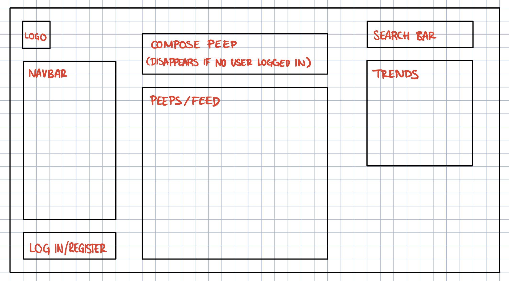

# Chitter Challenge by Elle Ordoña

## Technologies Used

- MongoDB
- Express.js
- React.js
- Node.js

---

## How to Run

---

## Acceptance Criteria

---

## Part 1

### User Story 1

```md
As a trainee software engineer
So that I can let people know what I am doing
I want to post a message (peep) to chitter
```

### Initial Thoughts 1

- Create a database in MongoDB
- Use a database to store the peeps posted
- POST request to a database
- Create simple static chitter page that displays the peep in the database

### Components 1

#### Database/Model/Validation

- Peeps
  - peepId (auto generated)
  - username
  - peepBody (character limit?) [`required`]
  - date (auto generated) [`required`]

#### Routes

- `/` (index)
- `/compose`

#### Services

- composePeep
- getAllPeeps

### Testing 1

**Test 1** - testing /GET => get all peeps

**Test 2** - testing /POST => peep must have a peepBody field

**Test 3** - testing /POST => peep must have a date field

**Test 4** - testing /POST => peep must have a valid date

**Test 5** - testing /POST => peep is created when properly formed

---

## Part 2

### User Story 2

```md
As a trainee
So that I can see what others are saying
I want to see all peeps in reverse chronological order
```

### Initial Thoughts 2

- You don't have to be logged in to see peeps
- Create a Date object when a peep is posted
- Front-end
- Reverse chronological: newest first
- Want the home page to look like this (Search Bar and Trends optional)
  
- Use CSS to add design to the page

### Components 2

- Homepage
  - Navbar
  - Login/Register
  - Logo
  - Compose Peep
  - Feed

### Domain Model 2

### Tests 2

---

## Part 3

### User Story 3

```md
As a trainee
So that I can better appreciate the context of a peep
I want to see the time at which it was made
```

### Initial Thoughts 3

- Use the date object to include the time stamp of when the peep was posted

### Domain Model 3

### Tests 3

---

## Part 4

### User Story 4

```md
As a trainee
So that I can post messages on Chitter as me
I want to sign up for Chitter
```

### Initial Thoughts 4

- Trainee SEs sign up with their email, password, name and a username (e.g ewright@digitalfutures.com, password123, Ed Wright, edwright6789)
- Usernames and emails are unique
- Use a database to store all the registered users

### Domain Model 4

### Tests 4

---

## Part 5

### User Story 5

```md
As a trainee
So that only I can post messages on Chitter as me
I want to log in to Chitter
```

### Initial Thoughts 5

- Login requires the user to have been registered
- Access to the database to make sure the user is registered

### Domain Model 5

### Tests 5

---

## Part 6

### User Story 6

```md
As a trainee
So that I can avoid others posting messages on Chitter as me
I want to log out of Chitter
```

### Domain Model 6

### Initial Thoughts 6

- Log out button will replace the Log in/Register button in the header when a user is logged in
- Look back at ed's log in example

### Tests 6

---

## Extended Criteria

---

## Part 7

### User Story 7

```md
As a trainee
So that I can stay constantly tapped in to the shouty box of Chitter
I want to receive an email if I am tagged in a peep
```

### Domain Model 7

### Initial Thoughts 7

### Tests 7

---

## Part 8

### User Story 8

```md
As a trainee
In order to start a conversation as a DFA trainee Software Engineer
I want to reply to a peep from another trainee
```

### Domain Model 8

### Initial Thoughts 8

### Tests 8
